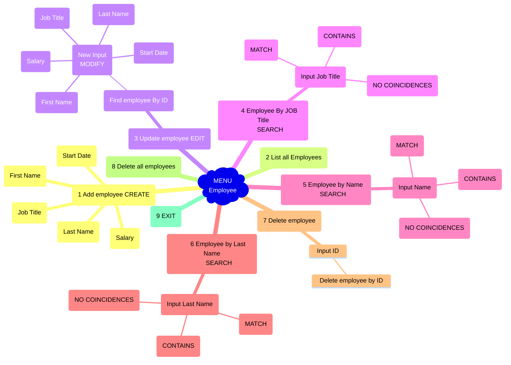

**Andrea García-González Manchón - Prueba Técnica 1:**

# Employee Assessment Guidelines 

## Menu Options

1. **Add Employee:**
   - Collect details for a new employee using `createEmployee`.
   - Utilize `stringValidator` and `doubleValidator` for input validation.

2. **List Employees:**
   - Display a list of all employees using `allEmployees`.

3. **Update Employee Info:**
   - Modify an employee's information based on the user-provided index.
   - Use `modifyEmployee` for updating employee details.

4. **Search by Job Title:**
   - Search for employees based on job title using `employeesByJobTitle`.

5. **Search by Name:**
   - Search for employees by first name using `employeesByName`.

6. **Search by Last Name:**
   - Search for employees by last name using `employeesByLastName`.

7. **Delete Employee:**
   - Delete an employee based on the user-provided index.
   - Implement `deleteEmployee` for specific employee deletion.

8. **Reset Base Data:**
   - Delete all employees from the database using `deleteallEmployees`.

9. **Exit:**
   - Exit the Employee Management System.

**At any time you can return to the menu by typing Return regardless of whether it is uppercase or lowercase.**

## User:
- User can create employee:
	- enter wrong parameters input, because of the validation in:
		- Name, Last Name, Job Title: String Validation
		- Salary: double validation.
		- Start Date: LocalDate validation allows you to enter dates from the creation of the company (08-25-2000) to the current date, it also includes the validation of past years, days of the month, and not exceeding the current date, as well as previous dates of the creation of the company, prints personalized messages to inform the user of their error at all times.  EXAMPLE:
		
- User can edit employee:
	- Can edit all the attributes from Employee class, after each modification you can update more parameters or if you want return to the menu
- User can search By JobTitle, Name, Last Name:
	- can have results about MATCH and/or CONTAINS depending on the coincidence.
- User can delete one Employee by Id
- User can delete all Employees
- User can see all the Employees
- User can return at any time from any input by typing return regardless of case, and the current operation will be canceled.
- User can exit from the Menu.

## Structure:

- [src](https://github.com/Andrea0o0/Garcia-Gonzalez-Manchon-Andrea_pruebatec1/tree/main/src) 
	- [javadoc](https://github.com/Andrea0o0/Garcia-Gonzalez-Manchon-Andrea_pruebatec1/tree/main/src/javadoc)
	- [mysqlEmployee](https://github.com/Andrea0o0/Garcia-Gonzalez-Manchon-Andrea_pruebatec1/tree/main/src/mysqlEmployee)
	- [main](https://github.com/Andrea0o0/Garcia-Gonzalez-Manchon-Andrea_pruebatec1/tree/main/src/main)
		* [practical exercises.assessment1](https://github.com/Andrea0o0/Garcia-Gonzalez-Manchon-Andrea_pruebatec1/tree/main/src/main/java/practicalexercises/assessment1) 
			* [Assessment1.java](https://github.com/Andrea0o0/Garcia-Gonzalez-Manchon-Andrea_pruebatec1/blob/main/src/main/java/practicalexercises/assessment1/Assessment1.java)
			* [Menu.java](https://github.com/Andrea0o0/Garcia-Gonzalez-Manchon-Andrea_pruebatec1/blob/main/src/main/java/practicalexercises/assessment1/Menu.java)
		* [practicalexercises.assessment1.entities](https://github.com/Andrea0o0/Garcia-Gonzalez-Manchon-Andrea_pruebatec1/tree/main/src/main/java/practicalexercises/assessment1/entities)
			* [ReturnMenu.java](https://github.com/Andrea0o0/Garcia-Gonzalez-Manchon-Andrea_pruebatec1/blob/main/src/main/java/practicalexercises/assessment1/entities/ReturnMenu.java)
		* [practicalexercises.assessment1.models](https://github.com/Andrea0o0/Garcia-Gonzalez-Manchon-Andrea_pruebatec1/tree/main/src/main/java/practicalexercises/assessment1/models) 
			* [Employee.java](https://github.com/Andrea0o0/Garcia-Gonzalez-Manchon-Andrea_pruebatec1/blob/main/src/main/java/practicalexercises/assessment1/models/Employee.java)
		* [practicalexercises.assessment1.persistence](https://github.com/Andrea0o0/Garcia-Gonzalez-Manchon-Andrea_pruebatec1/tree/main/src/main/java/practicalexercises/assessment1/persistence)
			* [EmployeeJpaController.java](https://github.com/Andrea0o0/Garcia-Gonzalez-Manchon-Andrea_pruebatec1/blob/main/src/main/java/practicalexercises/assessment1/persistence/EmployeeJpaController.java)
			* [PersistenceController.java](https://github.com/Andrea0o0/Garcia-Gonzalez-Manchon-Andrea_pruebatec1/blob/main/src/main/java/practicalexercises/assessment1/persistence/PersistenceController.java)
		* [practicalexercises.assessment1.persistence.exceptions](https://github.com/Andrea0o0/Garcia-Gonzalez-Manchon-Andrea_pruebatec1/tree/main/src/main/java/practicalexercises/assessment1/persistence/exceptions)
			* [IllegalOrphanException.java](https://github.com/Andrea0o0/Garcia-Gonzalez-Manchon-Andrea_pruebatec1/blob/main/src/main/java/practicalexercises/assessment1/persistence/exceptions/IllegalOrphanException.java)
			* [NonexistentEntintyException.java](https://github.com/Andrea0o0/Garcia-Gonzalez-Manchon-Andrea_pruebatec1/blob/main/src/main/java/practicalexercises/assessment1/persistence/exceptions/NonexistentEntityException.java)
			* [PreexistingEntityException.java](https://github.com/Andrea0o0/Garcia-Gonzalez-Manchon-Andrea_pruebatec1/blob/main/src/main/java/practicalexercises/assessment1/persistence/exceptions/PreexistingEntityException.java)
		* [practicalexercises.assessment1.services](https://github.com/Andrea0o0/Garcia-Gonzalez-Manchon-Andrea_pruebatec1/tree/main/src/main/java/practicalexercises/assessment1/services)
			* [EmployeeService.java](https://github.com/Andrea0o0/Garcia-Gonzalez-Manchon-Andrea_pruebatec1/blob/main/src/main/java/practicalexercises/assessment1/services/EmployeeService.java)
			* [Validator.java](https://github.com/Andrea0o0/Garcia-Gonzalez-Manchon-Andrea_pruebatec1/blob/main/src/main/java/practicalexercises/assessment1/services/Validator.java)

## Requirements:

1. Clone the repository
2. Use IDE like Netbeans 17, IntelliJ or Eclipse
3. Use JDK 17 or less (to avoid mistakes)
4. Download MySQL dependency 
5. Import Employee Database data to your Database
6. Run the code

## Assumptions:

### Data Entry Accuracy:
User provides valid inputs for names, job titles, and salary values.

### Knowledge of Indices:
User is familiar with indices for update, delete, or search operations.

### Company Start Date:
Assumes the company's start date is August 25, 2000.

### Understanding of Salary Type:
Assumes users understand salary input is either annual or monthly.

### English Language Proficiency:
Assumes users have a good understanding of English.

### Console and Menu Operation:
Assumes users are familiar with the console and menu-driven interface.

### Recognition of Data Deletion Value:
Assumes users recognize the significance of deleting data.

### Single User Interaction:
Assumes a single user or adherence to usage rules.

### No Employee Duplication:
Assumes users avoid creating duplicate employee records.

### Database Connection Understanding:
Assumes users understand how to connect dependencies to the Employee database.

### Database Name and User Information:
Assumes the database is named "employee," and the user is "ROOT" with no password requirement.

### The JavaDoc:
There is a folder with all the [JavaDoc](https://github.com/Andrea0o0/Garcia-Gonzalez-Manchon-Andrea_pruebatec1/tree/main/src/javadoc) information or documentation as well as its HTML for viewing the project.

### Employee Database MySql:
I have exported the database information in [mysqlEmployee](https://github.com/Andrea0o0/Garcia-Gonzalez-Manchon-Andrea_pruebatec1/tree/main/src/mysqlEmployee) inside the folder.
